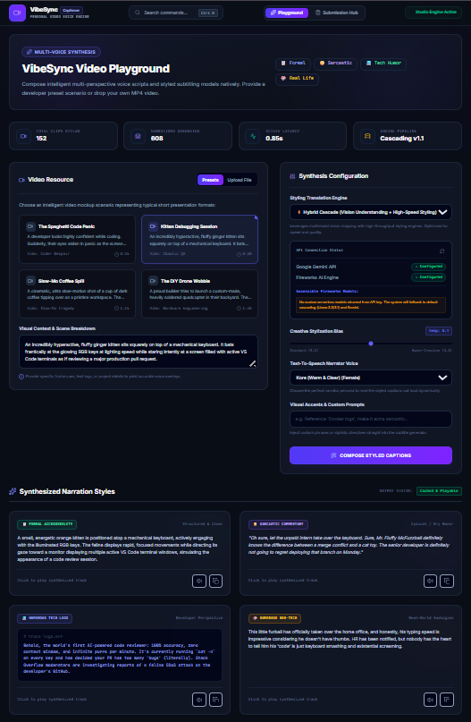
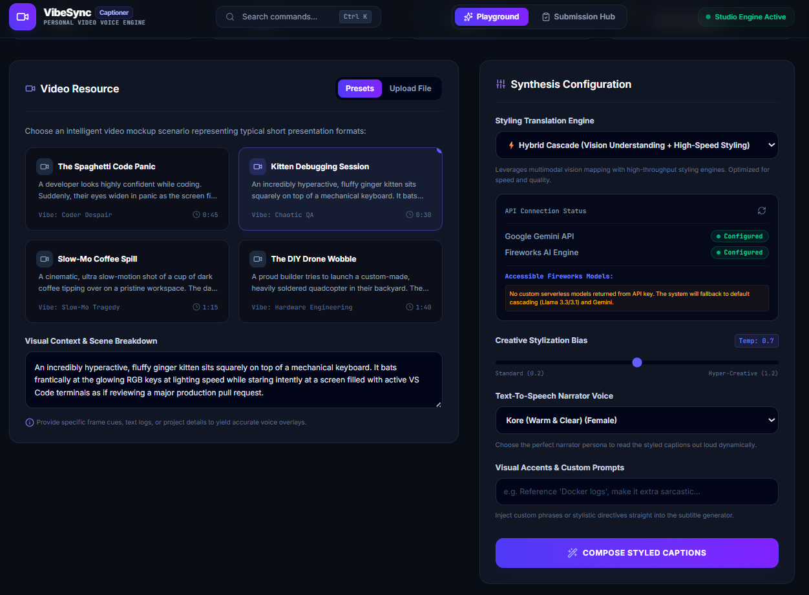
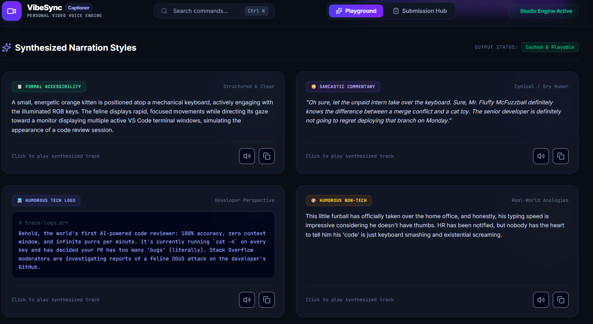
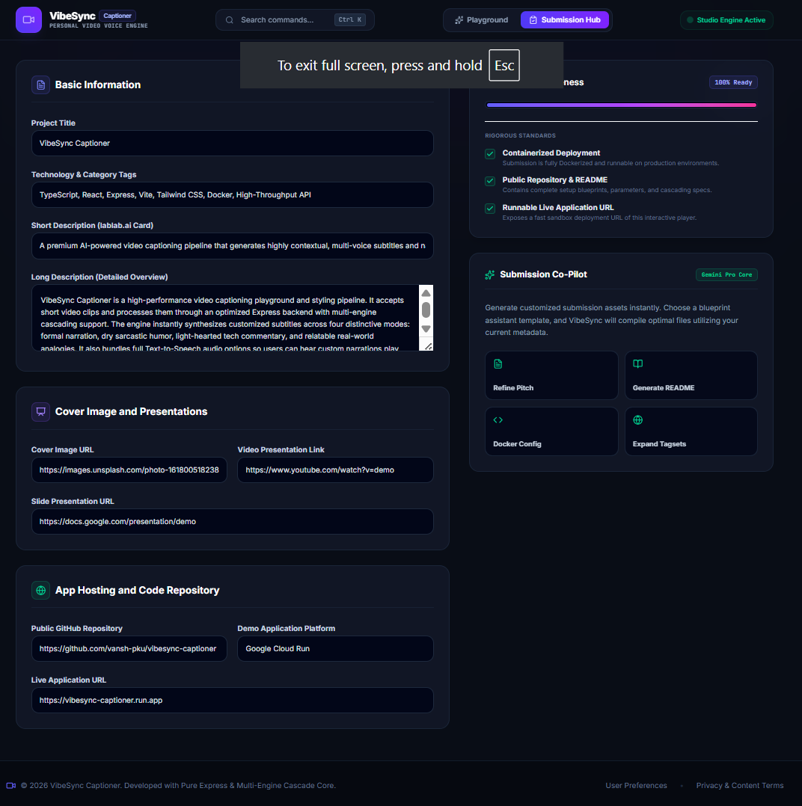

# 🎬 VibeSync Captioner

> **AI-powered Video Captioning Playground with Multi-Style Caption Generation, Text-to-Speech, Dockerized Deployment, and Intelligent Multi-LLM Routing.**


---

# 📌 Overview

VibeSync Captioner is a production-ready AI-powered application that analyzes short videos and generates **four distinct caption styles** from a single understanding of the scene.

The project combines **computer vision**, **multimodal AI**, and **large language models** into an interactive React application while also supporting automated batch processing through a Python pipeline.

Designed for the **AMD Developer Hackathon – Track 2 (Video Captioning)**, the application demonstrates an efficient caption generation workflow using a **"See Once, Style Multiple Times"** architecture.

---

# ✨ Features

- 🎥 Upload and analyze short videos
- 🤖 AI-powered scene understanding
- 📝 Generate four unique caption styles
  - Formal
  - Sarcastic
  - Humorous Tech
  - Humorous Non-Tech
- 🔊 Built-in Text-to-Speech playback
- ⚡ Hybrid AI routing using Gemini + Fireworks
- 🔄 Intelligent fallback system
- 📊 LLM-based caption evaluation
- 📥 Download generated captions
- 🌙 Modern responsive React UI
- 🐳 Fully Dockerized
- 💻 Batch Processing CLI
- 📴 Offline testing mode

---

# 🖼 Screenshots

## Home

> **

---

## Upload Workflow

> **

---

## Caption Generation

> **

---

## Batch Submission Hub

> **

---

# 🏗 Architecture

```
                  Video Upload
                       │
                       ▼
             OpenCV Video Processing
                       │
                       ▼
          Gemini Vision Analysis
                       │
             Scene Description
                       │
                       ▼
        Fireworks AI Caption Styling
                       │
                       ▼
      Four Caption Variations Generated
                       │
          ┌────────────┴────────────┐
          ▼                         ▼
    Text-to-Speech             LLM Evaluation
          │                         │
          └────────────┬────────────┘
                       ▼
                  React Frontend
```

---

# 🧠 AI Pipeline

Instead of asking an LLM to repeatedly analyze the same video, VibeSync uses an optimized workflow:

1. Analyze the video once using Gemini Vision.
2. Produce a factual scene description.
3. Generate multiple caption styles from the same description.
4. Optionally synthesize speech.
5. Evaluate caption quality.

This significantly reduces token usage while maintaining caption quality.

---

# ⚡ Intelligent Multi-LLM Routing

The application includes an automatic fallback architecture to improve reliability.

```
Gemini Vision
      │
      ▼
Retry with Alternate Gemini Models
      │
      ▼
Fireworks AI Styling
      │
      ▼
Final Gemini Fallback (if required)
```

This helps the application continue working even during temporary model overloads or API rate limits.

---

# 💻 Technology Stack

## Frontend

- React 19
- TypeScript
- Vite
- TailwindCSS

## Backend

- Node.js
- Express
- TypeScript

## AI

- Google Gemini
- Fireworks AI

## Video Processing

- Python
- OpenCV

## Speech

- Gemini Text-to-Speech
- gTTS

## Deployment

- Docker
- Multi-stage Docker Build

---

# 📁 Project Structure

```
VibeSync/
│
├── src/
├── server.ts
├── pipeline.py
├── main.py
├── package.json
├── requirements.txt
├── Dockerfile
├── README.md
└── .env.example
```

---

# 🚀 Running Locally

## Prerequisites

- Node.js 18+
- Python 3.11+
- Docker (optional)

---

## Clone Repository

```bash
git clone https://github.com/vansh-gautam-bit/vibesync-captioner.git

cd vibesync-captioner
```

---

## Install Dependencies

### Node

```bash
npm install
```

### Python

```bash
python -m venv venv
```

Windows

```bash
venv\Scripts\activate
```

Linux/macOS

```bash
source venv/bin/activate
```

Install Python packages

```bash
pip install -r requirements.txt
```

---

## Configure Environment

Create a `.env` file.

```env
GEMINI_API_KEY=your_gemini_api_key

FIREWORKS_API_KEY=your_fireworks_api_key

FIREWORKS_MODEL=accounts/fireworks/models/minimax-m3

OFFLINE_MODE=false
```

---

## Start Development Server

```bash
npm run dev
```

Visit

```
http://localhost:3000
```

---

# 🐳 Docker

## Build Image

```bash
docker build -t vibesync .
```

---

## Run Container

```bash
docker run --env-file .env -p 3000:3000 vibesync
```

Open

```
http://localhost:3000
```

---

# 📴 Offline Mode

To test the application without consuming API credits:

```env
OFFLINE_MODE=true
```

---

# 📄 Example Output

```json
{
  "formal": "A software engineer is working at a computer while debugging code.",
  "sarcastic": "Ah yes, another flawless deployment that definitely won't break production.",
  "humorousTech": "POV: You fixed one bug and created three microservices.",
  "humorousNonTech": "That face you make when your computer takes longer to think than you do."
}
```

---

# 📈 Project Highlights

- ✅ Multi-Style Caption Generation
- ✅ Gemini Vision Analysis
- ✅ Fireworks AI Styling
- ✅ Intelligent AI Fallback
- ✅ OpenCV Video Processing
- ✅ Text-to-Speech
- ✅ Dockerized Deployment
- ✅ Batch Processing
- ✅ Responsive React UI
- ✅ Offline Testing Mode

---

# 📹 Demo

**Demo Video**

> *(Add YouTube Link)*

---

# 📊 Presentation

**Slides**

> *(Add Google Slides Link)*

---

# 🌐 Repository

GitHub

> *https://github.com/vansh-gautam-bit/vibesync-captioner*

---

# 👨‍💻 Built For

**AMD Developer Hackathon**

Track 2 — Video Captioning Pipeline

---

# 📜 License

MIT License